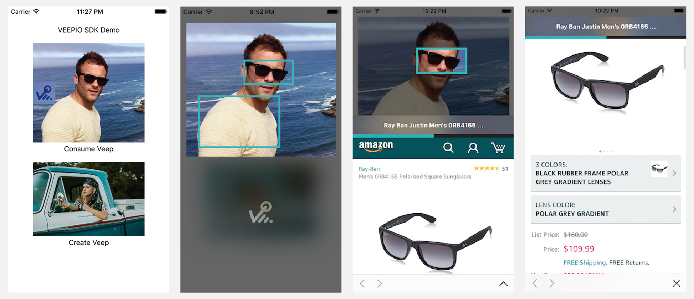
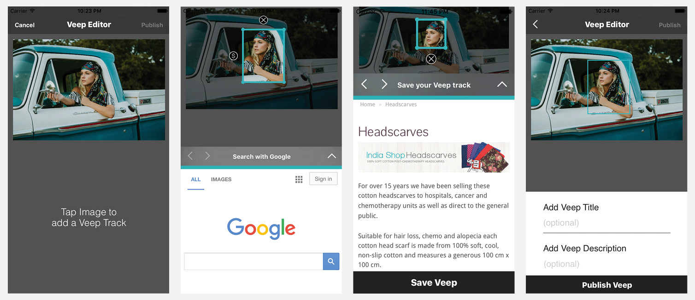

# VPKit Documentation

VPKit is an iOS SDK for generating interactive media which provides a seamless transition from a social feed to an e-commerce experience.

To use VPKit, you might decide to replace an UIImage with a VPKPreview. Your image is now interactive, and your team can manage the journey and gain analytical insight.

A VEEP is a metadata object defining the transition from an image or video in a social feed to an e-commerce experience or a URL.


## A little more about the SDK

### Creating a VEEP

TODO: VEEP CREATION SEQUENCE DIAGRAM

To create a VEEP, simply tap the CREATE DEMO IMAGE (NUMBER IN SEQUENCE). This will launch the veep editor (NUMBER IN SEQUENCE). The user is then prompted to add a veep track by tapping an object of interest within media. Veep tracks define an object of interest within an area of image. Veep tracks tapped during media consumption will send users to a URL. After defining a number of veep tracks, the user can use the Publish button to finalize the veep (NUMBER IN SEQUENCE).

#### Defining a VEEP track

<!---->



To define a veep track on a veep, the user first taps an object of interest in the media from within the veep editor (NUMBER IN SEQUENCE). The user can then manipulate the bounding box while choosing their URL (NUMBER IN SEQUENCE). To choose a URL, the user is prompted to search google. After the user leaves Google they will be allowed to save the veep.

This is the flow for the creation of a veep. A user is presented an image with coach marks. A user then manipulates the coach marks around a veep track that they wish to tag. A user is then prompted to search for the URL which will be associated to the veep track. A user is then prompted to publish the content when ready.

### Previewing a VEEP



This is the flow for the consumption of a veep. A user can easily identify VEEPIO interactive media by the appearence of the VEEPIO icon. A User taps on an image to learn if veep tracks are interactive within media content. The user is then presented with the coach marks around media image. Coached marked images are interactive. Click on interactive object of intrest to view product preview in a webview below media. Click expand icon " ^ " to view webview in full screen mode. Click "X" icon to exit full screen web view. Tap screen below interative media to return to home feed. 


## Installation with Binary

1. Drag and drop the binary blob into your XCode project
2. Ensure that you have the ```App Transport Security Settings``` key your project's Custom iOS Target Properties. This should be a dictionary with a key: ```Allow Arbitrary Loads``` set to ```YES``` This will ensure the correct app permissions are set in order for the web view to appear.

```xml
 <key>NSAppTransportSecurity</key>
    <dict>
        <key>NSAllowsArbitraryLoads</key>
        <true/>
    </dict> 
```
3. Follow the usage instructions below

    
## Usage

### Initialization

Firstly, you'll need to introduce your application to VEEPIO

```swift
VPKit.setApplicationIdentifier("Veepio-iOS")
```

```objective-c
[VPKit setApplicationIdentifier appID:@"Veepio-iOS"]
```

Next, you'll need to assign a unique identifier for your users. This might be a random string, or an ???advertising id???, or a username or an email address.

### Viewing
The easiest way to use the VEEPIO functionality is to use a `VPKPreview` in your UI. `VPKPreview` is a drop-in replacement for an `UIImage` that accepts an extra argument `veepID` on initialization. The SDK provides functionality for creating a VEEP, but we've also created a test image and a test VEEP. The app developer may typically store the VEEP id in their database.

```swift
imageView.image = VPKImage(image: foo, veepID: 1234)
```

```objc
imageView.image = [VPKImage initWithImage image:foo image, veepID: 1234)
```

### Manual VEEP viewer instantiation
The `VPKImage` class is necessary to measure the proportion of users who view tap an image having seen it. However, if you don't need this important engagement metric, you can open the VEEP viewer manually.

```swift
VPKVeepViewer(image, view)
```

```objc
??? [VPKVeepViewer viewerWithImage image:image view:view]
```

### User generated content
If you want to allow your users to VEEP their own user generated content from within your app, you can open the VEEP editor:

```swift
VPKVeepEditor(image, view)
```

```objc
??? [VPKVeepEditor viewerWithImage image:image view:view]
```

### Customization

All UI in VPKit is customizable to fit in with your app UI design. The following example makes the navigation bar red:

```swift
    VPKColorStyles.navBar = UIColor.red()
```

```objc
    VPKColorStyles.navBar = [UIColor red]
```

## Reference

#### VPKImage

    @property (nonnull, nonatomic, strong, readonly) NSString* veepID;
 
    - (nonnull instancetype)initWithImage:(nonnull UIImage*)image   
                                   veepID:(nonnull NSString*)veepID;
`

#### VPKPublicVeep

    @property (nonnull, nonatomic, strong) NSString* veepID;
    @property (nullable, nonatomic, strong) NSString* title;
    @property (nullable, nonatomic, strong) NSString* descriptionString;
    @property (nullable, nonatomic, strong) NSURL* originalContentURI;
    
## VPKitClass methods

#### Initialising VPKit

    + (void)setApplicationIdentifier:(nonnull NSString*)appID;
    
#### User identification

    + (void)setEmail:(nullable NSString*)email;
	
#### Consume Veep'd content

    + (nullable VPKVeepViewer*)viewerWithImage:(VPKImage*)image 
                                      fromView:(UIView*)view

#### Create Veep'd content

    + (nullable VPKVeepEditor*)editorWithImage:(UIImage*)image 
                                      fromView:(UIView*)view`
                                      
#### Fetch a VPKPublicVeep

    + (void) requestVeep:(NSString*)veepID 
        completionBlock:^(VPKPublicVeep* _Nullable veep,
                          NSError* _Nullable error) completion;
                          
## Controlling appearance

#### VPKStyles

    @property (nonatomic, assign) CGFloat lineWidth;
    @property (nonatomic, assign) CGFloat margin;

#### VPKFontStyles
	
	@property (nonatomic, strong) UIFont* barButtonItemFontDisabled;
	@property (nonatomic, strong) UIFont* barButtonItemFontEnabled;
	@property (nonatomic, strong) UIFont* barButtonItemFont;
	@property (nonatomic, strong) UIFont* navBarFont;
	@property (nonatomic, strong) UIFont* cellNavBarFont;
	@property (nonatomic, strong) UIFont* cellLabelFont;
	@property (nonatomic, strong) UIFont* cellTextViewFont;
	@property (nonatomic, strong) UIFont* bigLabelFont;


#### VPKColorStyles

	@property (nonatomic, strong) UIColor* navBar; //used
	@property (nonatomic, strong) UIColor* navBarText;
	
	@property (nonatomic, strong) UIColor* navBarLight; //used
	@property (nonatomic, strong) UIColor* navBarDark; //used
	@property (nonatomic, strong) UIColor* cellNavBar; //used
	@property (nonatomic, strong) UIColor* cellMidGrey; //used
	
	@property (nonatomic, strong) UIColor* searchBar;
	@property (nonatomic, strong) UIColor* alert;
	@property (nonatomic, strong) UIColor* on;
	@property (nonatomic, strong) UIColor* off;


## Common Problems

### WebView not loading

Ensure that you have the ```App Transport Security Settings``` key your project's Custom iOS Target Properties. This should be a dictionary with a key: ```Allow Arbitrary Loads``` set to ```YES``` This will ensure the correct app permissions are set in order for the web view to appear.

```xml
 <key>NSAppTransportSecurity</key>
    <dict>
        <key>NSAllowsArbitraryLoads</key>
        <true/>
    </dict> 
```
                                  
   