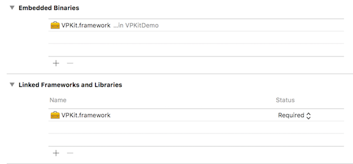

# VPKit Documentation

VPKit is an iOS SDK for generating interactive media which provides a seamless transition from a social feed to an e-commerce experience.

To use VPKit, you might decide to replace a UIImageView with a VPKPreview. Your image is now interactive, and your team can manage the journey and gain analytical insight.

A VEEP is a metadata object defining the transition from an image or video in a social feed to an e-commerce experience or a URL.


## A little more about the SDK

VPKit is supplied as a pre-compiled dynamic framework ready for drag-and-drop use in your Swift or Objective-C iOS project. A demo app is provided in each language showing how to incorprate and use the SDK.

### Viewing a VEEP image


VEEPIO interactive media are identified by the Veep icon overlay in `VPKPreview` imageViews.   
 
- Tapping the CONSUME image (a `VPKPreview`) launches the `VPKVeepViewer` view controller.  
- Interactive areas of images are marked by veep track borders.  
- Click on veep track to view linked web content  below the media.   
- Click the expand icon " ^ " to view the webview in full screen mode.  
- Click "X" icon to exit full screen web view.   
- Swipe the image to dismiss the `VPKVeepViewer` and return to your place in the hosting app. 


### Creating a VEEP image

<!---->


The demo app includes a CREATE image to show how veep content is originated.

- Tapping the CREATE image launches the `VPKVeepEditor` view controller. 
- The user may add veep tracks by tapping an area of interest in the image. 
- Each track can be moved and reshaped by maniupulating it's bounding box. 
- Each track can also be associated with a URL using the Google and Amazon search pages. 
- After defining one or more  veep tracks, the user can published the veep. 
- This will send the Veep metadata to Veepio's hosting servers and return a VeepID for you to store in your app. 

The VEEP metadata can in turn be consumed using a `VPKPreview` object as mentioned above.

##Downloading VPKit framework and demos

The demo apps are hosted on Github with pre-compiled binary VPKit Framework  
[github.com/veepionyc/VPKitDemo](http://www.github.com/veepionyc/VPKitDemo)

## Installation with Binary in your app

- Drag and drop the `VPKit.framework` binary into your XCode project  
- Ensure the framework is included in "Embedded Binaries" and "Linked Frameworks and Libraries" in the general tab of your target settings.

   


- Add the ```App Transport Security Settings``` key to your poject's info.plist, with a sub-key of ```Allow Arbitrary Loads``` set to ```YES```   

This will ensure the correct app permissions are set in order for the web view to appear.

	xml
	 <key>NSAppTransportSecurity</key>
	    <dict>
	        <key>NSAllowsArbitraryLoads</key>
	        <true/>
	    </dict> 

    
## Usage

### Initialization

Firstly, you'll need to introduce your application to VEEPIO. The App Delegate is a good location for this.

	[swift]
	VPKit.setApplicationIdentifier("Veepio-iOS")

	
	[objective-c]
	[VPKit setApplicationIdentifier appID:@"Veepio-iOS"]

Next, you'll need to assign a unique identifier for your users. This might be a random string, or an ???advertising id???, or a username or an email address.

### Viewing
The easiest way to use the VEEPIO functionality is to use a `VPKPreview` in your UI. `VPKPreview` is a drop-in replacement for an `UIImage` that accepts an extra argument `veepID` on initialization. The SDK provides functionality for creating a VEEP, but we've also created a test image and a test VEEP. The app developer may typically store the VEEP id in their database.

```swift
imageView.image = VPKImage(image: foo, veepID: 1234)
```

```objc
imageView.image = [VPKImage initWithImage image:foo image, veepID: 1234)
```

### Manual VEEP viewer instantiation
The `VPKImage` class is necessary to measure the proportion of users who view tap an image having seen it. However, if you don't need this important engagement metric, you can open the VEEP viewer manually.

```swift
VPKVeepViewer(image, view)
```

```objc
??? [VPKVeepViewer viewerWithImage image:image view:view]
```

### User generated content
If you want to allow your users to VEEP their own user generated content from within your app, you can open the VEEP editor:

```swift
VPKVeepEditor(image, view)
```

```objc
??? [VPKVeepEditor viewerWithImage image:image view:view]
```

### Customization

All UI in VPKit is customizable to fit in with your app UI design. The following example makes the navigation bar red:

```swift
    VPKColorStyles.navBar = UIColor.red()
```

```objc
    VPKColorStyles.navBar = [UIColor red]
```

## Reference

#### VPKImage

    @property (nonnull, nonatomic, strong, readonly) NSString* veepID;
 
    - (nonnull instancetype)initWithImage:(nonnull UIImage*)image   
                                   veepID:(nonnull NSString*)veepID;
`

#### VPKPublicVeep

    @property (nonnull, nonatomic, strong) NSString* veepID;
    @property (nullable, nonatomic, strong) NSString* title;
    @property (nullable, nonatomic, strong) NSString* descriptionString;
    @property (nullable, nonatomic, strong) NSURL* originalContentURI;
    
## VPKitClass methods

#### Initialising VPKit

    + (void)setApplicationIdentifier:(nonnull NSString*)appID;
    
#### User identification

    + (void)setEmail:(nullable NSString*)email;
	
#### Consume Veep'd content

    + (nullable VPKVeepViewer*)viewerWithImage:(VPKImage*)image 
                                      fromView:(UIView*)view

#### Create Veep'd content

    + (nullable VPKVeepEditor*)editorWithImage:(UIImage*)image 
                                      fromView:(UIView*)view`
                                      
#### Fetch a VPKPublicVeep

    + (void) requestVeep:(NSString*)veepID 
        completionBlock:^(VPKPublicVeep* _Nullable veep,
                          NSError* _Nullable error) completion;
                          
## Controlling appearance

#### VPKStyles

    @property (nonatomic, assign) CGFloat lineWidth;
    @property (nonatomic, assign) CGFloat margin;

#### VPKFontStyles
	
	@property (nonatomic, strong) UIFont* barButtonItemFontDisabled;
	@property (nonatomic, strong) UIFont* barButtonItemFontEnabled;
	@property (nonatomic, strong) UIFont* barButtonItemFont;
	@property (nonatomic, strong) UIFont* navBarFont;
	@property (nonatomic, strong) UIFont* cellNavBarFont;
	@property (nonatomic, strong) UIFont* cellLabelFont;
	@property (nonatomic, strong) UIFont* cellTextViewFont;
	@property (nonatomic, strong) UIFont* bigLabelFont;


#### VPKColorStyles

	@property (nonatomic, strong) UIColor* navBar; //used
	@property (nonatomic, strong) UIColor* navBarText;
	
	@property (nonatomic, strong) UIColor* navBarLight; //used
	@property (nonatomic, strong) UIColor* navBarDark; //used
	@property (nonatomic, strong) UIColor* cellNavBar; //used
	@property (nonatomic, strong) UIColor* cellMidGrey; //used
	
	@property (nonatomic, strong) UIColor* searchBar;
	@property (nonatomic, strong) UIColor* alert;
	@property (nonatomic, strong) UIColor* on;
	@property (nonatomic, strong) UIColor* off;


## Common Problems

### WebView not loading

Ensure that you have the ```App Transport Security Settings``` key your project's Custom iOS Target Properties. This should be a dictionary with a key: ```Allow Arbitrary Loads``` set to ```YES``` This will ensure the correct app permissions are set in order for the web view to appear.

```xml
 <key>NSAppTransportSecurity</key>
    <dict>
        <key>NSAllowsArbitraryLoads</key>
        <true/>
    </dict> 
```
                                  
   