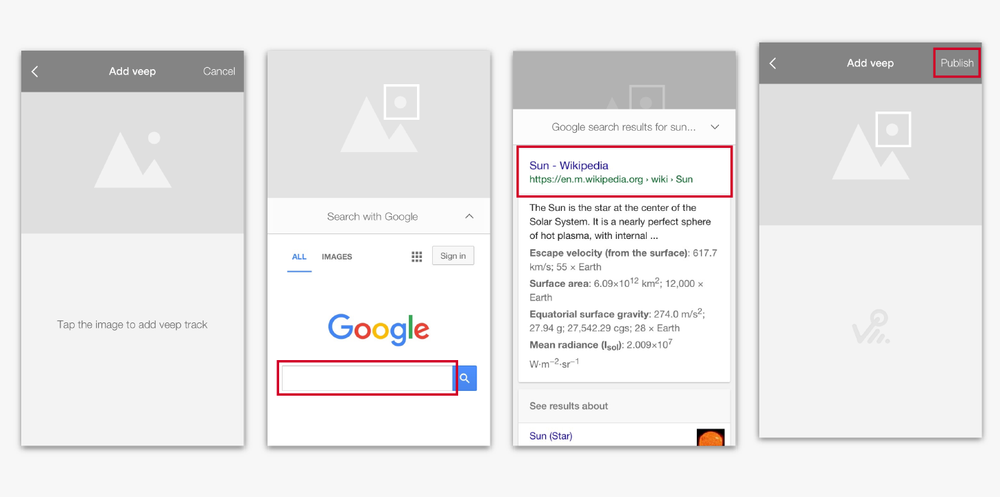

# VPKit Documentation

VPKit is an iOS SDK for generating interactive media which provides a seamless transition from a social feed to an e-commerce experience.

To use VPKit, you might decide to replace a UIImageView with a VPKPreview. Your image is now interactive, and your team can manage the journey and gain analytical insight.

A VEEP is a metadata object defining the transition from an image or video in a social feed to an e-commerce experience or a URL.

The SDK can be __[downloaded from our Github repository](http://www.github.com/veepionyc/VPKitDemo)__

For installation help and more information: __sdk_support@veepio.com__ or use the __[VPKitDemo issue tracker](https://github.com/veepionyc/VPKitDemo/issues)__


## A little more about the SDK

VPKit is supplied as a pre-compiled dynamic framework ready for drag-and-drop use in your Swift or Objective-C iOS project. A demo app is provided in each language showing how to incorporate and use the SDK.

### Viewing a VEEP image


VEEPIO interactive media are identified by the Veep icon overlay in `VPKPreview` imageViews.

- Tapping the CONSUME image (a `VPKPreview`) launches the `VPKVeepViewer` view controller.
- Interactive areas of images are marked by veep track borders.
- Click on veep track to view linked web content below the media.
- Click the expand icon " ^ " to view the webview in full screen mode.
- Click "X" icon to exit full screen web view.
- Swipe the image to dismiss the `VPKVeepViewer` and return to your place in the hosting app.


### Creating a VEEP image

<!---->


The demo app includes a CREATE image to show how veep content is originated.

- Tapping the CREATE image launches the `VPKVeepEditor` view controller.
- The user may add veep tracks by tapping an area of interest in the image.
- Each track can be moved and reshaped by manipulating its bounding box.
- Each track can also be associated with a URL using the Google and Amazon search pages.
- After defining one or more  veep tracks, the user can publish the veep.
- This will send the Veep metadata to Veepio's hosting servers and return a VeepID for you to store in your app.

The VEEP metadata can in turn be consumed using a `VPKPreview` object as mentioned above.

## Downloading VPKit framework and demos

The demo apps are hosted on Github with pre-compiled binary VPKit Framework
__[github.com/veepionyc/VPKitDemo](http://www.github.com/veepionyc/VPKitDemo)__

## Installation with Binary in your app

- Drag and drop the `VPKit.framework` binary into your XCode project
- Ensure the framework is included in "Embedded Binaries" and "Linked Frameworks and Libraries" in the general tab of your target settings.


- Add the ```App Transport Security Settings``` key to your project's info.plist, with  sub-keys:
    -   `Allow Arbitrary Loads : YES`
    -   `Allow Arbitrary Loads in Web Content : YES` 

`NSAllowsArbitraryLoadsInWebContent` is the correct key for iOS 10; `NSAllowsArbitraryLoads` is the fallback setting for iOS 9 and is ignored if the former key is available for iOS 10.
		
	<key>NSAppTransportSecurity</key>
	<dict>
		<key>NSAllowsArbitraryLoads</key>
		<true/>
		<key>NSAllowsArbitraryLoadsInWebContent</key>
		<true/>
	</dict>
	
This will ensure the correct app permissions are set in order for the web view to appear. Apple have indicated that setting these to 'YES' will require justification when submitting to the app store - although this restriction has not been implemented yet.  


## Usage

### Initialization in your App Delegate

Firstly, you'll need to introduce your application to VEEPIO. The App Delegate is a good location for this. A triplet of unique strings identify your app to the Veepio SDK: appID, clientID and clientSecret. To obtain these identifiers, contact skd_support@veepio.com. 

For testing purposes you can use the identifiers for the Veepio test app:

```swift
//Swift
let appID = "VEEPIO_test_app_id"
let clientID = "VsRIkxIfTtkFJhw1ABItnO50B6fSW23NhIRnST53"
let clientSecret = "OdWbCaP9i1I2AV2yZUzwfDFE4gU04RDX1HdubnTEg8oWw8F9yWQwjX179zHRXLUad5vrsOo5B7UtFq2utsrWbkjVus5aJKxW8wXTvDknqdgeowunL9yeEN8selNpTOJF"
        
VPKit.setApplicationId(appID,
             clientId: clientID,
         clientSecret: clientSecret)
```

```objc
//objective-c

NSString* appID = @"VEEPIO_test_app_id";
NSString* clientID = @"VsRIkxIfTtkFJhw1ABItnO50B6fSW23NhIRnST53";
NSString* clientSecret = @"OdWbCaP9i1I2AV2yZUzwfDFE4gU04RDX1HdubnTEg8oWw8F9yWQwjX179zHRXLUad5vrsOo5B7UtFq2utsrWbkjVus5aJKxW8wXTvDknqdgeowunL9yeEN8selNpTOJF";
	    
[VPKit setApplicationId:appID
               clientId:clientID
           clientSecret:clientSecret];
```
	
This is also a good place to add any custom fonts and colours to the veep viewer. Examples in the demo apps:

```swift
//Swift
VPKit.styles().margin = 12
VPKit.styles().color.navBar = UIColor.init(white: 0.1, alpha: 1.0)
VPKit.styles().font.navBarFont = UIFont .systemFont(ofSize: 18, weight: UIFontWeightHeavy);
VPKit.styles().font.cellNavBarFont = UIFont .systemFont(ofSize: 14, weight: UIFontWeightBold);
```

```objc
//objecive-C
[VPKit styles].margin = 12;
VPKit.styles.color.navBar = [UIColor colorWithWhite:0.1 alpha:1.0];
VPKit.styles.font.navBarFont = [UIFont systemFontOfSize:18 weight:UIFontWeightHeavy];
VPKit.styles.font.cellNavBarFont = [UIFont systemFontOfSize:14 weight:UIFontWeightBold];
```

### Viewing

#### VPKPreview

The easiest way to use the VEEPIO functionality is to use a `VPKPreview` in your UI.
- `VPKPreview` is a drop-in replacement for a `UIImageView`.
- It is initialized with a `VPKImage` - which is a `UIImage` subclass with added `VeepID` property.
- It provides an animated VEEP icon to indicate that an image is interactive.


```objc
//objective-C
self.vpkPreview = [[VPKPreview alloc] init];
[self.view addSubview:self.vpkPreview];
UIImage* image = [UIImage imageNamed:@"KrispyGlas"];
image = [[VPKImage alloc] initWithImage:image veepID:@"658"];
self.vpkPreview.image = image;
```

```swift
//swift
let preview = VPKPreview()
guard let image = UIImage.init(named: "KrispyGlas") else {return}
let previewImage: VPKImage = VPKImage(image: image, veepID:"658")
self.preview.image = previewImage;
self.preview.delegate = self
self.view.addSubview(self.preview)
```


#### VPKVeepViewer

The `VPKVeepViewer` view Controller is initialized with a `VPKImage` and its associated `VPKPreview`.
These methods are delegate callbacks from the VPKPreview on receiving a use touch event:

```swift
//swift
func vpkPreviewTouched(_ preview:VPKPreview, image:VPKImage){
	guard let viewer = VPKit.viewer(with: image, from: preview) else {return}
    viewer.delegate = self
    viewer.modalPresentationStyle = UIModalPresentationStyle.overFullScreen
    preview.hideIcon()
    self.present(viewer, animated: true, completion: nil)
}
```

```objc
//objective-c
- (void)vpkPreviewTouched:(VPKPreview *)preview image:(VPKImage*)image {
    self.vpViewer = [VPKit viewerWithImage:image
                                  fromView:preview];
    self.vpViewer.delegate = self;
    self.vpViewer.modalPresentationStyle = UIModalPresentationOverFullScreen;
    [preview hideIcon];
    [self presentViewController:self.vpViewer animated:YES completion:nil];
}
```

(NB: If you don't set a delegate on VPKPreview, these methods can be omitted and similar behaviour is provided by default from the VPKPreview object itself)


### Creating veep content

If you want to allow your users to VEEP their own user generated content from within your app, you can open the VEEP editor:

```swift
//swift
guard let vpEditor = VPKit.editor(with: image, from: self.imageButton) else {return}
vpEditor.useVeepLogo = false
vpEditor.delegate = self
vpEditor.modalPresentationStyle = UIModalPresentationStyle.overFullScreen
self.present(vpEditor, animated: true, completion: nil)
```
  
```objc
//objective-C
self.vpEditor = [VPKit editorWithImage:self.imageButton.image
                              fromView:self.imageButton];
self.vpEditor.useVeepLogo = NO;
if (self.vpEditor) {
    self.vpEditor.delegate = self;
    self.vpEditor.modalPresentationStyle = UIModalPresentationOverFullScreen;
    [self presentViewController:self.vpEditor animated:YES completion:nil];
}
```
 
 
### Customization

All UI in VPKit is customizable to fit in with your app UI design.

The following example makes the navigation bar red:

```swift
//swift
VPKit.styles().color.navbar = UIColor.red()
```

```objc
//objective-c
VPKit.styles.color.navbar = [UIColor red]
```


## Reference

#### VPKImage

    @property (nonnull, nonatomic, strong, readonly) NSString* veepID;

    - (nonnull instancetype)initWithImage:(nonnull UIImage*)image
                                   veepID:(nonnull NSString*)veepID;


#### VPKPublicVeep

    @property (nonnull, nonatomic, strong) NSString* veepID;
    @property (nullable, nonatomic, strong) NSString* title;
    @property (nullable, nonatomic, strong) NSString* descriptionString;
    @property (nullable, nonatomic, strong) NSURL* originalContentURI;

## VPKitClass methods

#### Initializing VPKit

    + (void)setApplicationIdentifier:(nonnull NSString*)appID;

<!--#### User identification

    + (void)setEmail:(nullable NSString*)email;-->

#### Consume Veep'd content

    + (nullable VPKVeepViewer*)viewerWithImage:(VPKImage*)image
                                      fromView:(UIView*)view

#### Create Veep'd content

    + (nullable VPKVeepEditor*)editorWithImage:(UIImage*)image
                                      fromView:(UIView*)view`

#### Fetch a VPKPublicVeep

    + (void) requestVeep:(NSString*)veepID
        completionBlock:^(VPKPublicVeep* _Nullable veep,
                          NSError* _Nullable error) completion;

## Controlling appearance

#### VPKStyles

    @property (nonatomic, assign) CGFloat lineWidth;
    @property (nonatomic, assign) CGFloat margin;

#### VPKFontStyles

	@property (nonatomic, strong) UIFont* barButtonItemFontDisabled;
	@property (nonatomic, strong) UIFont* barButtonItemFontEnabled;
	@property (nonatomic, strong) UIFont* barButtonItemFont;
	@property (nonatomic, strong) UIFont* navBarFont;
	@property (nonatomic, strong) UIFont* cellNavBarFont;
	@property (nonatomic, strong) UIFont* cellLabelFont;
	@property (nonatomic, strong) UIFont* cellTextViewFont;
	@property (nonatomic, strong) UIFont* bigLabelFont;


#### VPKColorStyles

	@property (nonatomic, strong) UIColor* navBar;
	@property (nonatomic, strong) UIColor* navBarText;

	@property (nonatomic, strong) UIColor* navBarLight;
	@property (nonatomic, strong) UIColor* navBarDark;
	@property (nonatomic, strong) UIColor* cellNavBar;
	@property (nonatomic, strong) UIColor* cellMidGrey;


## Support


For installation help and more information: __sdk_support@veepio.com__ or use the __[VPKitDemo issue tracker](https://github.com/veepionyc/VPKitDemo/issues)__


